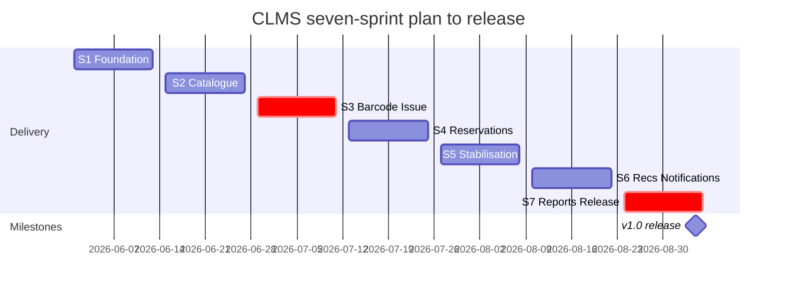

# CLMS Sprint Plan — Full Seven-Sprint Planning Record

**Course:** 24CSI015 — Software Engineering with Agile Practices · **Project key:** CLMS (JIRA id 10034, Scrum board 35)
**Status of this document:** this is the team's authoritative **planning record** for sprints 1–7. Calendar dates, per-sprint narratives and burndown descriptions are the planning record; story points, owner totals and test/coverage figures are measured from the backlog and repository.
All tables below were re-summed programmatically before publication (assertions listed in §5).

---

## 1. Release frame

| Item | Value |
|---|---|
| Sprint length | 2 weeks (10 working days), Mondays–Fridays |
| Sprints | 7 (S1–S7), 1 Jun 2026 → 4 Sep 2026 |
| Release date | 4 Sep 2026 |
| Team | S. Nidhish Guhan S (Product Owner / dev), Kawaskar J (Scrum Master / dev) |
| Scope at planning close | 37 stories, **126 story points**; 125 delivered, US-37 (1 pt) deferred to v1.1 |
| Velocity (completed accepted pts / sprint) | 17, 16, 18, 22, 13, 16, 23 → mean **17.9** |
| Board note | Sprints “Sprint 1 - Foundation” … “Sprint 5 - Release” are closed on the board; S6–S7 were added in this replan record after that session — the board carries epics/stories with resolution marking in progress |

Planned-vs-completed accounting convention: a carried story counts in the **planned** column of the sprint it was committed to *and* of the sprint that finishes it (US-15: S3+S4; US-30: S6+S7). That double count (5 pts) is the whole difference between planned total 131 and unique scope 126.

## 2. Sprint-by-sprint record

### Sprint 1 — Foundation (1–12 Jun 2026)

**Goal:** staff can sign in, RBAC works, members and persistence exist; JsonStore safety proven by tests.

| US | Short title | Pts | Owner | Completed |
|---|---|---:|---|---|
| US-01 | Sign-in endpoint — bcrypt + JWT | 3 | N | ✔ |
| US-02 | Layered scaffold + atomic JsonStore | 5 | N | ✔ |
| US-03 | Sign-in screen, role-aware nav | 3 | K | ✔ |
| US-04 | Member management API + validation | 3 | K | ✔ |
| US-05 | Members admin screen | 3 | K | ✔ |

Planned **17** · Completed **17** · Carry 0 · Velocity 17.
Burndown (planning record): flat first two days (store + scaffold spike), steady diagonal days 5–10, zero at review. Retro: keep persistence-safety tests before stateful features; stand up supertest harness next.

### Sprint 2 — Catalogue & Search (15–26 Jun 2026)

**Goal:** catalogue CRUD, working multi-field search, copy registration with identifiers.

| US | Short title | Pts | Owner | Completed |
|---|---|---:|---|---|
| US-06 | Book CRUD API + guards | 3 | N | ✔ |
| US-07 | Catalogue browse page | 3 | K | ✔ |
| US-08 | Search matching engine | 5 | N | ✔ |
| US-09 | Title detail + availability rollup | 2 | K | ✔ |
| US-10 | Copy registration flow | 3 | K | ✔ |

Planned **16** · Completed **16** · Carry 0 · Velocity 16.
Burndown: smooth; US-08's 5 points consumed a full mid-sprint pairing day (both developers), no tail risk reached the final days.

### Sprint 3 — Barcode & Issue Core (29 Jun–10 Jul 2026)

**Goal:** unique barcodes + Code 128 rendering, copy lifecycle, the issue transaction and desk UI.
**Note:** planned 21 pts against a trailing average of 16.5 — the one over-commitment of the release (risk R3/R6, Unit II §9).

| US | Short title | Pts | Owner | Completed in S3 |
|---|---|---:|---|---|
| US-11 | Auto barcode `LIB-<BOOKCODE>-NNN` + dup guard | 3 | N | ✔ |
| US-12 | Copy status lifecycle + Code 128 SVG endpoint | 5 | N | ✔ |
| US-13 | Issue transaction — eligibility/due date/loan | 5 | N | ✔ |
| US-14 | Circulation desk UI — scan issue + receipt | 5 | K | ✔ |
| US-15 | Reservation eligibility + priority queue rules | 3 | N | ✖ **carried** |

Planned **21** · Completed **18** · Carry-out 3 pts.
Burndown: on track to day 8; final two days flattened at 3 pts remaining while the READY-cancel path was diagnosed — **defect RES-001 found in TESTING** (cancelling a READY reservation strands a copy out of circulation). Team decision: carry US-15, book the fix explicitly into S4 rather than ship a half-solved queue rule.

### Sprint 4 — Reservations, Return & My Library (13–24 Jul 2026)

**Goal:** absorb the carry, deliver the full reserve→hold→collect loop and member self-service screens.

| US | Short title | Pts | Owner | Completed |
|---|---|---:|---|---|
| US-15 | (carry) Reservation rules completion + RES-001 fix design | 3 | N | ✔ |
| US-16 | Return transaction — late days, penalty, redispatch | 3 | N | ✔ |
| US-17 | Desk return UI + renew action | 3 | K | ✔ |
| US-18 | Member reservation flow | 3 | K | ✔ |
| US-19 | My Library — loans/holds/history/fines tabs | 5 | K | ✔ |
| US-20 | Staff reservation management + copy assignment | 5 | K | ✔ |

Planned **22** · Completed **22** (carry absorbed) · Carry 0 · Velocity 22 — release max.
Burndown: the carried 3 pts burned off by day 3 (fix-first ordering, as decided in the S3 retro), then linear. RES-001 regression test added to the integration suite this sprint.

### Sprint 5 — Penalties, Policies & Stabilisation (27 Jul–7 Aug 2026)

**Goal:** deliberate capacity cut (13 pts planned vs 17.0 trailing average) for a stabilisation half + hardening half: fines end-to-end, admin-editable policy, hold-expiry correctness.

| US | Short title | Pts | Owner | Completed |
|---|---|---:|---|---|
| US-21 | READY-hold expiry + cancel with redispatch | 3 | N | ✔ |
| US-22 | Penalty rules — ₹1/day, ₹50 block, receipts | 3 | N | ✔ |
| US-23 | Fines tab + staff settlement flow | 3 | K | ✔ |
| US-24 | Admin-editable policy document | 3 | N | ✔ |
| US-25 | Borrow-block enforcement | 1 | N | ✔ |

Planned **13** · Completed **13** · Velocity 13.
Burndown: unusually short scope line; days spent on test-pack expansion (EP/BVA/decision tables) do not appear on the story line but show as zero carry-outs afterwards. Retro: stabilise-before-evidence pattern adopted for S7 too.

### Sprint 6 — Recommendations & Notifications (10–21 Aug 2026)

**Goal:** deterministic explainable recommendations and the notification subsystem.

| US | Short title | Pts | Owner | Completed in S6 |
|---|---|---:|---|---|
| US-26 | Preference profile + weighted scoring rules | 5 | N | ✔ |
| US-27 | “Recommended for you” + reason strings | 5 | K | ✔ |
| US-28 | Similar-books panel | 3 | K | ✔ |
| US-29 | Notification storage + API | 3 | N | ✔ |
| US-30 | Notification bell + list UI | 2 | K | ✖ **carried** |

Planned **18** · Completed **16** · Carry-out 2 pts.
Events in the sprint: **defect UI-002** (`` cannot attach the JWT to barcode SVGs — fixed by authenticated fetch + injected SVG, later proven in Selenium step) and **defect E2E-003** (autofocus-dependent login selector flaked — fixed by explicit `.login-card input` indexing). The fixer time they consumed is the reason for the small carry — the retro decision from S4 (“reserve fixer capacity”) worked but was sized at 0 pts.

### Sprint 7 — Reports, Admin, E2E Evidence & Release (24 Aug–4 Sep 2026)

**Goal:** management reporting, audit/admin surfaces, both Selenium journeys green, release decision.

| US | Short title | Pts | Owner | Completed |
|---|---|---:|---|---|
| US-30 | (carry) Notification bell + list UI | 2 | K | ✔ |
| US-31 | Notification engine + `/notifications/scan` | 5 | N | ✔ |
| US-32 | Reports dashboard (5 reports) | 5 | K | ✔ |
| US-33 | Report aggregation service endpoints | 3 | K | ✔ |
| US-34 | Audit-log viewer + staff account UI | 3 | K | ✔ |
| US-35 | Daily sweep — hold expiry, overdue alerts, penalties | 3 | N | ✔ |
| US-36 | Selenium E2E journeys + selector stability | 2 | K | ✔ |
| US-37 | Postgraduate project-browsing portal (stretch) | 1 | K | ✖ **deferred** |

Planned **24** · Completed **23** · Velocity 23.
At the S7 review the product owner deferred US-37 (1 pt) plus a 1-pt planning buffer to the v1.1 backlog rather than absorb them into release week — the release criterion was “both E2E journeys green + all defect log entries CLOSED”, both met on 4 Sep 2026.

## 3. Cross-sprint summary

| Sprint | Stories planned | Planned pts | Completed pts | Carry-in | Carry-out | Deferred | Velocity |
|---|---|---:|---:|---:|---:|---:|---:|
| S1 | US-01–05 | 17 | 17 | 0 | 0 | 0 | 17 |
| S2 | US-06–10 | 16 | 16 | 0 | 0 | 0 | 16 |
| S3 | US-11–15 | 21 | 18 | 0 | 3 (US-15) | 0 | 18 |
| S4 | US-15–20 | 22 | 22 | 3 | 0 | 0 | 22 |
| S5 | US-21–25 | 13 | 13 | 0 | 0 | 0 | 13 |
| S6 | US-26–30 | 18 | 16 | 0 | 2 (US-30) | 0 | 16 |
| S7 | US-30–37 | 24 | 23 | 2 | 0 | 1 (US-37) | 23 |
| **Total** | | **131** | **125** | **5** | **5** | **1** | mean **17.9** |

Unique backlog scope 126 = 125 delivered + 1 deferred. Planned 131 = 126 + 5 (carried points counted in both sprints).

### 3.1 Release burndown (remaining unique scope after each sprint, planning record)

| After sprint | S1 | S2 | S3 | S4 | S5 | S6 | S7 (release) |
|---|---:|---:|---:|---:|---:|---:|---:|
| Remaining (pts) | 109 | 93 | 75 | 53 | 40 | 24 | **1** (US-37 only — deferred at review; delivered backlog at 0) |

### 3.2 Velocity chart

```mermaid
xychart-beta
  title "Planned vs completed story points per sprint (planning record)"
  x-axis [S1, S2, S3, S4, S5, S6, S7]
  y-axis "Story points" 0 --> 26
  bar [17, 16, 21, 22, 13, 18, 24]
  bar [17, 16, 18, 22, 13, 16, 23]
```

(first bar pair per sprint = planned, second = completed; S3 +2 gap and S6 +2 gap are the two documented carry events, S7 +1 the deferral.)

### 3.3 Owner load per sprint (completed points)

| Sprint | Nidhish | Kawaskar | Total |
|---|---:|---:|---:|
| S1 | 8 | 9 | 17 |
| S2 | 8 | 8 | 16 |
| S3 | 13 | 5 | 18 |
| S4 | 6 | 16 | 22 |
| S5 | 10 | 3 | 13 |
| S6 | 8 | 8 | 16 |
| S7 | 8 | 15 | 23 |
| **Total delivered** | **61** | **64** | **125** |

The load inverts sprint-to-sprint (backend-heavy S3, frontend-heavy S4/S7) because stories were owned end-to-end inside the sprint that needed them; the near-50/50 total was the scheduling check at each planning session.

## 4. Gantt (planning record)

S3 and S7 marked `crit`: S3 is the sprint whose slip shaped S4's plan; S7 carries the release evidence bar (E2E + defect-log closure).

## 5. Verification note

Before this file was written, every table above was checked by a script asserting: per-sprint planned values `[17,16,21,22,13,18,24]` equal the sum of the US point values listed in each sprint's rows; completed = planned − carry-out − deferral per sprint giving `[17,16,18,22,13,16,23]`; completed total 125; planned total 131; unique scope 126; owner totals Nidhish 61 + Kawaskar 64 = 125; release burndown row equals 126 minus cumulative completed values. All assertions passed.
