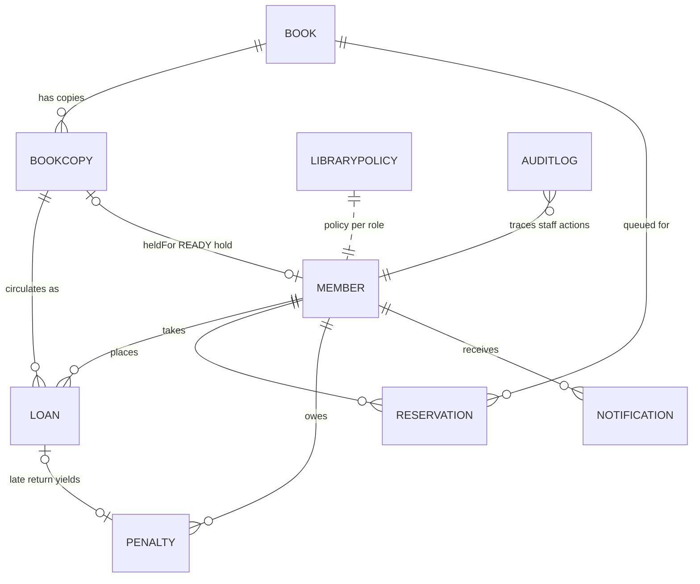
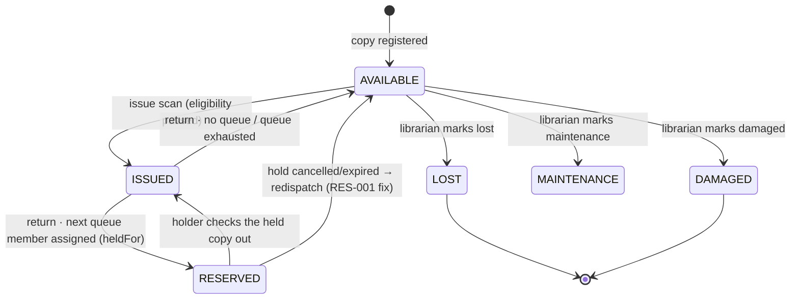
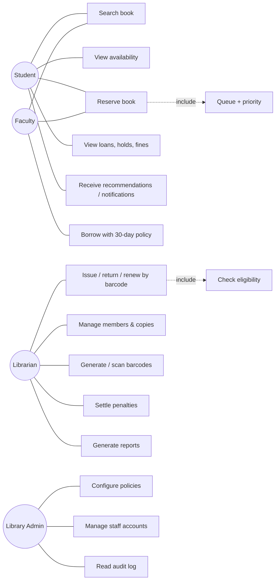
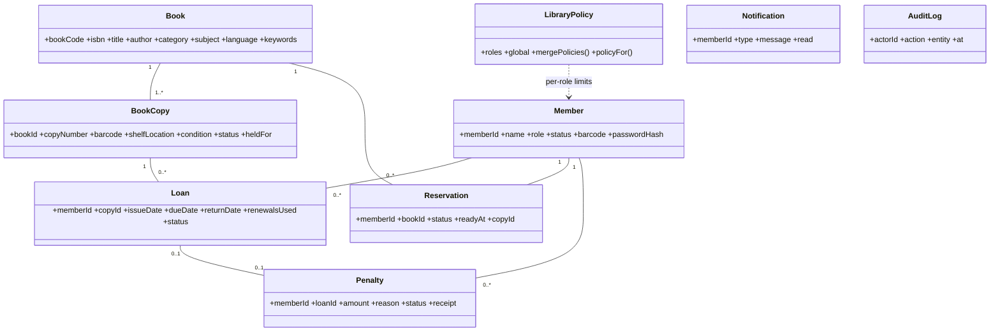
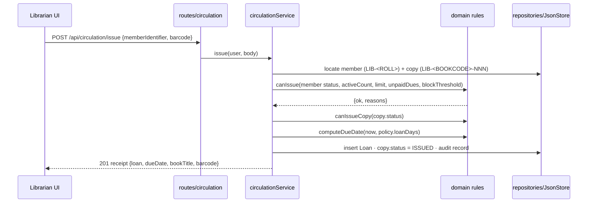
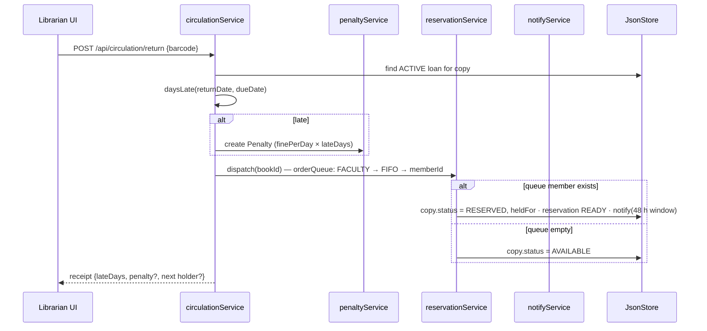

# Unit I — Software Engineering Fundamentals and Design

**Course:** 24CSI015 — Software Engineering with Agile Practices
**Project:** College Library Management System (CLMS) · v1.0
**Traceability:** blueprint §§1–17 (`College_Library_Management_System_Complete_Architecture.md`); all implementation claims verified against `backend/src/`, `frontend/src/` and `docs/metrics-report.json`.

---

## 1. Process model selection (blueprint §17)

### 1.1 Comparison considered

| Criterion | Waterfall | Spiral | Incremental Agile (chosen) |
|---|---|---|---|
| Requirements stability | Needs full up-front freeze; library rules were understood but their interaction (queue × penalty × eligibility) was not | Accepts evolving needs | Accepts evolving needs; rules refined per sprint |
| Risk handling | Late integration risk: circulation, reservations and penalties meet only at the end | Explicit risk loops per cycle, but heavy documentation overhead for a 2-person project | Risk retired per increment; a working slice exists from Sprint 1 |
| Feedback from a working system | After the final phase | Periodic, prototype-centred | Every 2 weeks (sprint review) |
| Fit to 12-module scope (§4) | Poor — cross-module state (copy lifecycle) needs joint testing | Moderate | Good — increments are chosen along module seams |
| Cost on a 2-person team | Rework-heavy | Planning-heavy | Balanced; ceremony cost measured and accepted |

**Decision rationale.** CLMS is multi-module (12 modules, §4) with strong cross-module state coupling (a copy is `RESERVED` by the reservation queue but `ISSUED` by circulation). Waterfall would defer the discovery of that coupling to final integration. Spiral's explicit risk-cycle cost buys little once the top risks (barcode uniqueness, policy correctness, inconsistent transactions) were addressed by design decisions in §§6, 9, 10, 12 rather than by prototypes. An incremental Agile approach (Scrum delivery cadence, XP engineering discipline — see Unit II) lets each increment put working software in front of the product owner every two weeks.

### 1.2 Incremental path actually followed (§17, §44)

```text
Requirements → Architecture → Inc.1 (auth/members/catalogue) → Test/Review
→ Inc.2 (copies/barcode/circulation) → Inc.3 (reservations/penalties)
→ Inc.4 (recommendations/notifications) → Inc.5 (reports/admin)
→ Stabilisation & hardening → Final system
```

Seven two-week sprints delivered these increments (planning record; see Unit II §5 and `docs/sprint-plan.md`).

---

## 2. Requirements engineering (blueprint §§1, 2, 15, 16)

### 2.1 Vision statement (§1)

A centralised system for managing members (students, faculty), staff (librarians, admins), catalogue titles, physical copies, barcode identity, issue/return/renew, reservations with queues, late-return penalties, notifications, reports and explainable personalised recommendations — reducing manual work, improving book visibility and preventing inconsistent records.

**Definition boundary (§46):** the recommendation engine is deterministic rule-based scoring over catalogue metadata and borrowing activity; no AI/ML components exist in the system.

### 2.2 Stakeholders and requirements capture (§2)

| Stakeholder | Interests (blueprint) | Realised capability (code evidence) |
|---|---|---|
| Student | search, borrow, reserve, view history/due dates/penalties, recommendations, notifications | `STUDENT` role: `/api/books`, `/api/reservations`, `/api/recommendations/for-me`, `/api/notifications`, `/api/penalties/mine` (routes/index.js); My Library page (`frontend/src/pages/MyLibrary.jsx`) |
| Faculty | same, with 30-day / 5-book policy | `FACULTY` role + per-role policy in `domain/policyRules.js` (`loanDays:30, maxBooks:5, maxReservations:5`) |
| Librarian | manage members/books/copies, generate & scan barcodes, issue/return/renew, reservations, penalties, reports | `LIBRARIAN`-guarded routes (`librarianOnly`), Circulation Desk (`CirculationDesk.jsx`) |
| Library Admin | policies, staff accounts, audit, analytics | `ADMIN`-guarded routes (`adminOnly`): `/api/admin/policies`, `/api/admin/users`, `/api/admin/audit`; Policies/AuditLog pages |

### 2.3 Functional requirements (§15) — requirements → implementation trace

| FR | Requirement (blueprint) | Implementing component | Verified by |
|---|---|---|---|
| FR-01 | Authenticate users | `services/authService.js` (bcrypt compare + JWT), `POST /api/auth/login` | Integration suite “Authentication (US-01..US-03)” |
| FR-02 | Manage student/faculty members | `services/memberService.js`, `/api/members` CRUD, status, password reset | Unit: `memberRules` suite; integration RBAC |
| FR-03 | Manage books | `services/catalogueService.js`, `/api/books` CRUD | Integration “Catalogue (US-05..US-10)” |
| FR-04 | Manage physical copies | `services/copyService.js`, `POST /api/books/:id/copies`, `PUT /api/copies/:id` | Integration “Copies & unique barcodes (US-11, US-12)” |
| FR-05 | Automatically generate unique barcodes | `domain/barcodeRules.js` (`LIB-<BOOKCODE>-NNN`), copy-number counter in `copyService` | Domain suite `barcodeRecommendation.test.js` |
| FR-06 | Search the catalogue | `catalogueService.search()` — title/author/ISBN/keyword/subject/category | Domain + integration |
| FR-07 | Display availability | `GET /api/books/:id` detail with per-copy status; availability rollup | E2E journey 1 step 3 (“RESERVED copy badge”) |
| FR-08 | Issue books | `circulationService.issue` (11, `domain/copyRules.js` — 12, `domain/loanRules.js` — 13) | Integration “Circulation — issue/return/renew (US-13..US-17)”; E2E journey 2 |
| FR-09 | Return books | `circulationService.returnCopy` → late days → penalty → queue redispatch | Integration; E2E journey 2 step 5 |
| FR-10 | Calculate due dates | `loanRules.computeDueDate(issueDate, loanDays)` | Unit suite (BVA cases, see Unit III §5) |
| FR-11 | Apply late-return penalties | `domain/penaltyRules.js` + `penaltyService`; sweep in `adminService.scan` (US-35) | Unit `memberPenaltyPolicy.test.js`; integration “Penalties (US-22, US-23)” |
| FR-12 | Manage reservations | `reservationService` reserve/cancel/mine/queue | Integration “Reservations + queue (US-18..US-21)” |
| FR-13 | Apply reservation priority | `domain/reservationRules.js` `orderQueue`: FACULTY → FIFO → memberId | Unit `reservationRules.test.js` |
| FR-14 | Send notifications | `notifyService` + due-soon (3 d), overdue, hold-ready event rules | Integration “Notifications (US-29..US-31)” |
| FR-15 | Generate recommendations | `domain/recommendationRules.js` weighted scoring; `recommendationService.forMe/similarTo` | Unit `barcodeRecommendation.test.js`; integration “Recommendations (US-26..US-28)” |
| FR-16 | Generate reports | `reportService`: summary, overdue, circulationTrend, popularBooks, mostReserved | Integration reports section |
| FR-17 | Maintain audit records | `services/auditService.js` → `data/audit.json`; `GET /api/admin/audit` | Integration admin section |

### 2.4 Non-functional requirements (§16) → design responses

| NFR (§16) | Design response | Evidence |
|---|---|---|
| Security: authentication, RBAC, protected records, audit | JWT bearer middleware + `requireRole(...)` guard factories; `assertSelfOrStaff` scoping on member-owned data; bcrypt hashes; audit trail | `middleware/auth.js`, `routes/index.js` (45 routes, guard applied before every write), error envelope strips stack traces (`app.js`) |
| Reliability: no duplicate barcodes, consistent transactions, no invalid copy states | Barcode built as `LIB-<BOOKCODE>-NNN` with existence check; every mutation is one `JsonStore.replaceAll` atomic tmp+rename write | `barcodeRules.js`, `db/store.js` (write `*.tmp` then `fs.renameSync`) |
| Usability: fast search, simple barcode workflow, clear availability, explainable recommendations | Single-scan desk UI; per-copy badges; every suggestion carries a reason string | `CirculationDesk.jsx`, `BookDetail.jsx`, `recommendationRules.reason()` |
| Performance: responsive search, fast circulation | In-process data access over pre-loaded JSON; O(n) scans bounded by seed-scale (34 copies, 12 titles); JSON body limit 512 kB | `repository.js` find/findOne; `app.js` |
| Maintainability: modular services, centralised rules, automated tests, documentation | `domain/` holds pure rules (no I/O); 121 automated tests; static metrics tooling | `metrics-report.json`, `tools/analyze.js` |

### 2.5 SRS packaging

The SRS for this submission is this document's §§2–3 (IEEE-830-style content: introduction §2.1, stakeholders §2.2, FR table §2.3, NFR table §2.4, external interfaces §3.2, design constraints §4.3) combined with the data model (§4) and UML set (§5). The blueprint is the requirements source; each FR carries an implementation trace (§2.3).

---

## 3. Architectural design (blueprint §§3–4)

### 3.1 Layered architecture as implemented

Blueprint §3 specifies six layers over PostgreSQL. The implemented system is the same stack mapped onto a Node/Express process (the persistence substitution is a decision record — §4.3):

```mermaid
flowchart TD
  U[React 18 SPA — presentation\nLogin · Catalogue · My Library · Circulation Desk · Reports · Admin] --> A[Authentication + RBAC\nmiddleware/auth.js — JWT verify, requireRole, assertSelfOrStaff]
  A --> R[API layer — routes/index.js\n45 routes: 25 GET, 20 write]
  R --> S[Application services — services/*.js\nauth · member · catalogue · copy · circulation · reservation · penalty · recommendation · notify · report · admin · audit]
  S --> D[Domain layer — domain/*.js\nloanRules · copyRules · reservationRules · penaltyRules · policyRules · recommendationRules · barcodeRules · memberRules]
  S --> P[Repository layer — repositories/\nRepository collection facade over JsonStore]
  P --> J[Persistence — db/store.js\natomic JSON-file store (tmp + rename)]
  S --> AU[(AuditLog\nauditService)]
```

Layering rules enforced by structure: `domain/` modules import nothing from `services/`, `repositories/` or Express (verified by import inspection — pure functions, 96.83 % statement coverage); routes contain only request mapping and guards, delegating all logic to services.

### 3.2 Module decomposition (§4) → files

| Module (§4) | Backend files | Frontend surface |
|---|---|---|
| Authentication | `authService`, `middleware/auth` | `Login.jsx`, `auth.jsx` |
| Member Management | `memberService`, `domain/memberRules` | `Members.jsx` |
| Book Catalogue | `catalogueService` | `Catalogue.jsx`, `BookDetail.jsx` |
| Physical Copies | `copyService`, `domain/copyRules` | copy table in `BookDetail.jsx`, `BooksAdmin.jsx` |
| Barcode Management | `domain/barcodeRules`, `copyService.svgFor` (bwip-js Code 128) | `BarcodeSvg.jsx` |
| Circulation | `circulationService`, `domain/loanRules` | `CirculationDesk.jsx`, `MyLibrary.jsx` |
| Reservation | `reservationService`, `domain/reservationRules` | `MyLibrary.jsx`, queue in `CirculationDesk.jsx` |
| Penalty Management | `penaltyService`, `domain/penaltyRules` | Fines tab (`MyLibrary.jsx`) |
| Recommendations | `recommendationService`, `domain/recommendationRules` | “Recommended for you” (`Dashboard.jsx`) |
| Notifications | `notifyService` | bell + list (`App.jsx`, `Dashboard.jsx`) |
| Reports | `reportService` | `Reports.jsx` |
| Administration | `adminService`, `auditService`, `domain/policyRules` | `Policies.jsx`, `AuditLog.jsx` |

---

## 4. Data model (blueprint §§5, 12–13)

### 4.1 Entities (§13)

| Entity | Purpose | Key fields (as stored) |
|---|---|---|
| Member | Student/faculty library identity | `memberId` (roll), `role`, `status ACTIVE/SUSPENDED/BLOCKED`, `barcode LIB-<ROLL>`, `passwordHash` |
| Book | Catalogue-level information | `bookCode`, `isbn`, `title`, `author`, `publisher`, `edition`, `category`, `subject`, `language`, `keywords`, `publicationYear` |
| BookCopy | Individual physical copy | `bookId`, `copyNumber`, `barcode`, `shelfLocation`, `condition`, `status`, `heldFor` |
| Loan | Issue/return transaction | `memberId`, `copyId`, `issueDate`, `dueDate`, `returnDate`, `renewalsUsed`, `status ACTIVE/RETURNED` |
| Reservation | Reservation request + queue | `memberId`, `bookId`, `status WAITING/READY/DONE/CANCELLED/EXPIRED`, `readyAt`, `copyId` |
| Penalty | Late-return penalty record | `amount`, `reason`, `status PAID/UNPAID`, `receipt`, `receivedBy` |
| LibraryPolicy | Borrowing/penalty rules (single mutable document) | per-role `loanDays/maxBooks/maxReservations`; global `finePerDay=1`, `blockThreshold=50`, `renewLimit=2`, `holdDays=48`, `dueSoonDays=3`, `queueLimit=5` |
| RecommendationProfile / RecommendationScore | Derived preferences; score + explanation | computed per request in `recommendationRules.js` (not persisted — derived state) |
| Notification | User alert | `memberId`, `type`, `message`, `read` |
| AuditLog | Trace of important actions | `actorId`, `actorRole`, `action`, `entity`, `at` |

### 4.2 ER diagram (§12)



**Book vs BookCopy separation (§5)** is the central modelling decision: status (`AVAILABLE/ISSUED/RESERVED/LOST/DAMAGED/MAINTENANCE`) and barcode belong to a physical copy, not the title. Reservation queues are per `Book`, copy assignment happens at return time — this is what produced defect RES-001 (Unit III §9) and its redispatch rule.

### 4.3 Persistence decision: JSON-file store instead of PostgreSQL

Blueprint §3 assumed PostgreSQL. **The substitution to JSON files was an explicit user (product-owner) requirement** and is treated as a design-constraint change, recorded with its trade-offs:

| Concern | PostgreSQL design | Implemented JsonStore (`db/store.js`) |
|---|---|---|
| Crash consistency | Transactions/WAL | Every collection saved via write to `*.tmp` + `fs.renameSync` — atomic replace on POSIX; a torn file cannot appear |
| Uniqueness constraints | `UNIQUE(barcode)`, `UNIQUE(book_id,copy_number)` (§6) | Enforced in application layer: barcode built deterministically from `bookCode` + next copy number; `locate()` resolves by exact match; copy numbers unique by monotonic counter per book |
| Query capability | SQL joins | In-process `find/findOne/filter` over arrays (`repository.js`); joins performed in service code (loan → member → book denormalised fields `bookTitle`, `memberCode` stored on the loan for read efficiency) |
| Multi-process writes | Row-level locking | Single-process Node server documented constraint; store is one writer |
| Deployment weight | DB server required | Zero external services; `data/*.json` volume-mounted in Docker; `npm run seed` rebuilds initial state |
| Auditability | DB logs | Application audit log (`auditService`) |

The repository layer keeps this decision reversible: services talk to `Repository` collections, so swapping `JsonStore` for a Postgres adapter does not touch `domain/` or most of `services/`. This is the Open-Closed / layering argument cited in the ISO 25010 maintainability assessment (Unit III §10).

### 4.4 Copy state machine (§5 statuses, §14 “State Diagram”)



`canIssueCopy()` (`domain/copyRules.js`, CC 5) admits issue only from `AVAILABLE`; `MAINTENANCE/DAMAGED/LOST` are terminal for circulation. Reservation redispatch on cancel/expire is the behaviour regression-tested for RES-001 (Unit III §9).

---

## 5. UML set (blueprint §14)

### 5.1 Use-case diagram



Actors and major use cases match §14; «include» relationships mirror the code paths (`circulationService.issue` always runs `loanRules.canIssue`).

### 5.2 Class diagram (core classes from §14, as implemented)



### 5.3 Issue sequence (§7)



### 5.4 Return sequence (§8)



---

## 6. Barcode subsystem (blueprint §6)

### 6.1 Identity scheme

| Object | Identifier format | Example (seed data) |
|---|---|---|
| Physical copy | `LIB-<BOOKCODE>-<NNN>` | `LIB-CSHFP04-002` (Head First Design Patterns, copy 2) |
| Member | `LIB-<ROLL>` | `LIB-CSE2201` |

The copy identifier is *derived*, not random: book code + zero-padded copy number make collisions structurally impossible for distinct (book, copy-number) pairs, and the §6 duplicate guard (existence check before insert) protects against re-issued copy numbers.

### 6.2 Generation workflow (§6) → implementation

```text
Create Book → assign bookCode → POST /api/books/:id/copies {count|copies[]}
→ next copy number per book → identifier LIB-<BOOKCODE>-NNN
→ uniqueness check → save copy (status AVAILABLE) → render Code 128 SVG on demand
```

Rendering: `GET /api/barcodes/:barcode/svg` generates a Code 128 SVG with bwip-js at request time (`copyService.svgFor`); nothing is stored as an image. The member barcode follows the same SVG route. The frontend loads these SVGs through an authenticated `fetch` and injects the markup, because `` cannot carry the JWT (defect UI-002, Unit III §9; `components/BarcodeSvg.jsx`).

### 6.3 Scanning workflows

Issue and return are scan-first (§7–§8): the desk UI takes the member identifier and the copy barcode as keyboard-wedge scan input; `GET /api/circulation/eligibility?memberIdentifier=` renders the eligibility card (active loans, limits, dues, block state) before the issue scan is accepted — proven end-to-end in Selenium journey 2, step 2–3.

---

## 7. Design summary and evaluation

| Design property | Mechanism | Measured support |
|---|---|---|
| Separation of concerns | routes → services → domain → repositories → JsonStore | 29 production files, 1 498 LOC, avg McCabe 2.13 (`metrics-report.json`) |
| Centralised business rules (NFR maintainability) | `domain/` pure functions; policies as data | 96.83 % statement coverage on `src/domain` |
| Reliability of persisted state | atomic tmp+rename writes; derived unique identifiers | JsonStore unit suite (8 tests incl. crash-shape checks) |
| Explainability | reason strings on recommendations; decision-rule domain layer | every `forMe` suggestion carries a reason (FR table §2.3 FR-15) |
| Requirement → design → code trace | §§1–16 mapped in §2.3/§2.4 | 121 tests — 69 unit, 52 integration over the 45-route API |

**Known limitation (accepted):** the JsonStore design constrains CLMS to a single server process and college-scale data volumes; the repository seam bounds the cost of a future database migration.
