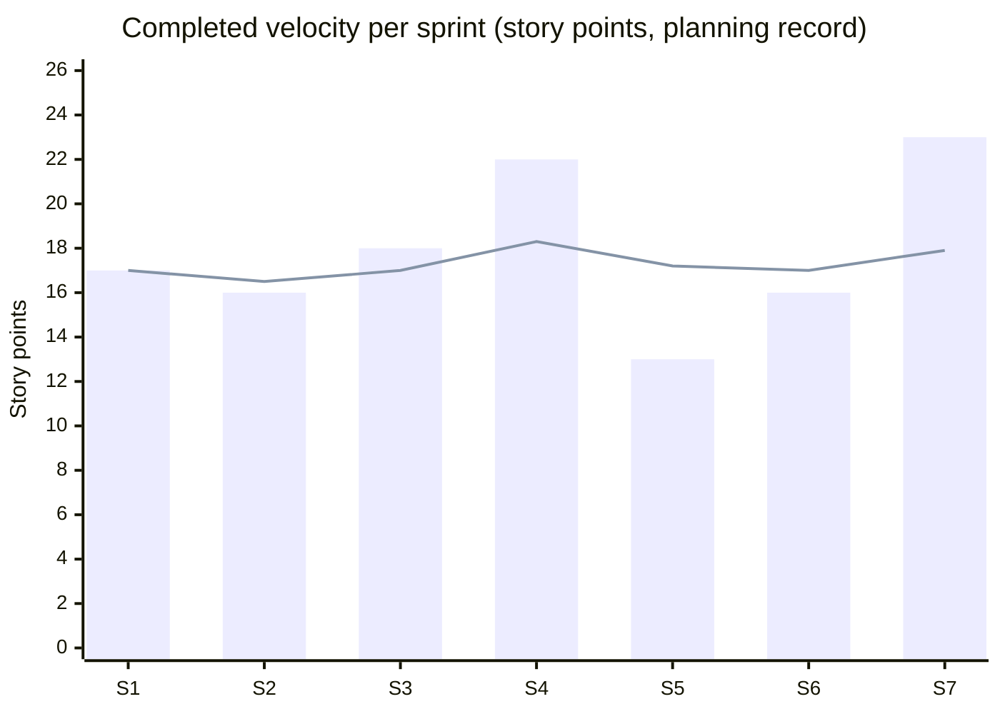
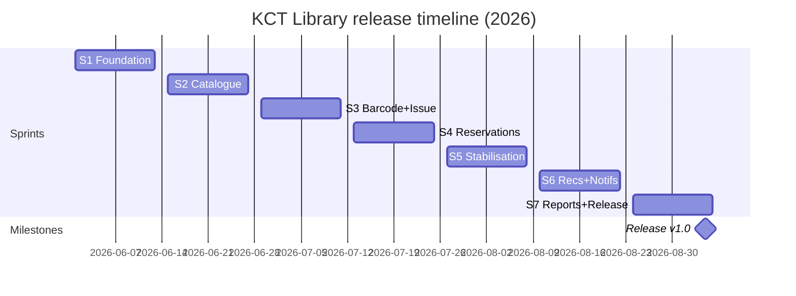

# Unit II — Agile Practices and Project Management

**Course:** 24CSI015 — Software Engineering with Agile Practices
**Project:** KCT Library · v1.0
**Traceability:** blueprint §§18–36; JIRA project **NS** ("KCT Library"); sprint arithmetic verified programmatically (see `docs/sprint-plan.md`). Dates, per-sprint plan/completed figures and retrospectives are the team's **planning record**; story points, counts and metrics are taken from the backlog and the repository.

---

## 1. Combined delivery model: Lean + Scrum + Kanban + XP (blueprint §§18–19)

The process follows the blueprint's four-way combination; each school owns one concern, and the table records how that appeared in this project:

| School | Concern (§18) | Concrete practice in KCT Library (§19 pattern) |
|---|---|---|
| Lean | Value + waste reduction | Barcode scanning removes repetitive manual entry at the circulation desk; MVP feature freeze (§42) rejected non-essential scope (e.g. no payment gateway — penalties stay a library rule, §9); policies stored as editable data instead of code changes |
| Scrum | Planning + incremental delivery | 7 two-week sprints, sprint goal per increment, review with the product owner after each, retrospective action fed into the next sprint (§39 improvement loop) |
| Kanban | Flow visibility + WIP | JIRA board NS board workflow `TO DO → IN PROGRESS → CODE REVIEW → TESTING → DONE`; WIP limit 2–3 active dev tasks per developer; defects (RES-001, UI-002, E2E-003) entered as cards and pulled by whoever was free in the affected module |
| XP | Engineering quality | TDD on domain rules (Unit III §4); pair programming on the issue/return paths (both developers' commits co-located in circulation files); continuous integration via GitHub Actions (`.github/workflows/ci.yml`); refactoring passes kept McCabe average at 2.15 |

**Integration worked example (blueprint §19 "Barcode Issue"):** Lean justified scan-first checkout; Scrum placed the story (US-13/US-14) in Sprint 3; Kanban visualised its move through review/testing with RES-001 stopping it in TESTING; XP supplied the failing-test-first fix and the regression test that now pins the redispatch behaviour.

## 2. Roles, ceremonies, working agreements (§18)

| Role | Person | Responsibilities in KCT Library |
|---|---|---|
| Product Owner + developer | S. Nidhish Guhan S | backlog order, MVP freeze, release decision (incl. US-37 deferral); architecture, BinaryStore, domain rules, backend services, CI/DevOps — 61 delivered story points |
| Scrum Master + developer | Kawaskar J | ceremony facilitation, board hygiene, impediment log; frontend, auth UX, barcode UI, E2E suites, documentation — 64 delivered story points |

| Ceremony | Cadence | Output recorded in |
|---|---|---|
| Sprint planning | day 1 of each sprint (2-week cadence) | sprint scope table in `docs/sprint-plan.md` |
| Daily stand-up | 15 min, asynchronous note on board | JIRA comments/transitions |
| Sprint review | last working day | acceptance walkthrough of the increment against story criteria; outcome text per sprint (§5.1) |
| Retrospective | after review | “kept / changed” note feeding next sprint's plan (§5 rows) |
| Backlog refinement | mid-sprint | story split, point re-estimates (§3) |

## 3. Estimation approach (§22)

- **Planning poker**, Fibonacci scale 1/2/3/5/8/13, relative effort not hours; scale per §22. The largest single story estimated was 5 points — complexity above that was split during refinement rather than estimated as 8/13 (e.g. circulation split into eligibility/issue/return UI stories).
- Reference points from §22 kept as calibration anchors (search 3, barcode generation 5, reservation 5, reports 5).
- Every story carries acceptance criteria (§21 requirement of ≥15 stories with AC — met with 37).

### 3.1 Acceptance-criteria examples (§21 pattern)

| Story | Given / When / Then (abridged) |
|---|---|
| US-07 Catalogue search | Given a signed-in student, when searching “Discrete Mathematics”, then matching titles are listed with copy availability counts (E2E journey 1 step 3 proves this) |
| US-13 Issue | Given member CSE2201 within limit and dues below ₹50, when scanning `LIB-CSHFP04-002`, then a loan is created with due date = issue + role loan days and the copy becomes ISSUED |
| US-15/21 Reservation | Given all copies of a title are out, when a member reserves it, then a queue position is assigned; on the first return the earliest-priority member's hold becomes READY with a 48 h collection window |
| US-22 Penalty | Given a loan returned 4 days late at ₹1/day, then a penalty of ₹4 is recorded; unpaid dues ≥ ₹50 block further borrowing |
| US-26/27 Recommendation | Given a member's loan/reservation history, when recommendations are requested, then each suggestion shows a reason built from the weighted score components and excludes already-borrowed titles |

## 4. Product backlog (§20, §22)

10 epics, 37 stories, total scope **126 story points** (§20 module outline expanded to the epics below; epic names align with §4 modules).

| Epic | Scope (§20/§4) | Stories | Points |
|---|---|---:|---:|
| E1 Foundation, Auth & Access | login, JWT, RBAC, architecture, binary store | US-01,02,03 | 11 |
| E2 Members | member records + management UI | US-04,05 | 6 |
| E3 Catalogue & Search | book CRUD, search, detail | US-06,07,08,09,37* | 14 |
| E4 Physical Copies & Barcodes | copy lifecycle, barcode generation/SVG | US-10,11,12 | 11 |
| E5 Circulation | issue, return, renew, desk UI | US-13,14,16,17 | 16 |
| E6 Reservations | queue, priority, holds, expiry | US-15,18,19,20,21 | 19 |
| E7 Penalties & Policies | fines, block rule, editable policy | US-22,23,24,25 | 10 |
| E8 Recommendations | profile, scoring, surfaces | US-26,27,28 | 13 |
| E9 Notifications | events, engine, sweep | US-29,30,31,35 | 13 |
| E10 Reports, Admin & Release Quality | reports, audit, admin UI, E2E evidence | US-32,33,34,36 | 13 |
| **Total** | | **37** | **126** |

\* US-37 (1 pt, stretch) sits in E3 for tracking; it is the only story not scheduled to completion (§5.8).

### 4.1 Full story list (id, points, primary owner, sprint)

| US | Points | Owner | Sprint | Short title |
|---|---:|---|---|---|
| US-01 | 3 | N | S1 | Sign-in endpoint — bcrypt verify + JWT issue |
| US-02 | 5 | N | S1 | Layered scaffold + atomic binary persistence |
| US-03 | 3 | K | S1 | Sign-in screen, token storage, role-aware navigation |
| US-04 | 3 | K | S1 | Member management API + validation wiring |
| US-05 | 3 | K | S1 | Members admin screen (edit, status, password reset) |
| US-06 | 3 | N | S2 | Book CRUD API with librarian/admin guards |
| US-07 | 3 | K | S2 | Catalogue browse page — search box, filters, badges |
| US-08 | 5 | N | S2 | Search matching engine (title/author/ISBN/keyword/subject) |
| US-09 | 2 | K | S2 | Title detail page with copy list + availability rollup |
| US-10 | 3 | K | S2 | Physical-copy registration flow (next copy number, shelf, condition) |
| US-11 | 3 | N | S3 | Automatic unique barcode `LIB-<BOOKCODE>-NNN` + duplicate guard |
| US-12 | 5 | N | S3 | Copy status lifecycle + Code 128 SVG endpoint (bwip-js) |
| US-13 | 5 | N | S3 | Issue transaction — eligibility, due date, loan, copy ISSUED |
| US-14 | 5 | K | S3 | Circulation desk UI — scan issue, eligibility card, receipt |
| US-15 | 3 | N | S3→S4 | Reservation eligibility + priority queue rules *(carried, RES-001)* |
| US-16 | 3 | N | S4 | Return transaction — late days, auto penalty, queue redispatch |
| US-17 | 3 | K | S4 | Desk return UI + renew action |
| US-18 | 3 | K | S4 | Member reservation flow — hold button, my holds, duplicate refusal |
| US-19 | 5 | K | S4 | My Library — loans, holds (READY 48 h / WAITING), history, fines tabs |
| US-20 | 5 | K | S4 | Staff reservation management — queue visibility, copy assignment |
| US-21 | 3 | N | S5 | READY-hold expiry + cancel with redispatch *(RES-001 fix + regression test)* |
| US-22 | 3 | N | S5 | Penalty rules — ₹1/day, ₹50 block, settlement receipt |
| US-23 | 3 | K | S5 | Fines tab + staff penalty settlement flow |
| US-24 | 3 | N | S5 | Admin-editable policy document (merge + validation, CC 14 validator) |
| US-25 | 1 | N | S5 | Borrow-block enforcement at unpaid-dues threshold |
| US-26 | 5 | N | S6 | Preference profile + weighted scoring rules |
| US-27 | 5 | K | S6 | “Recommended for you” surface with reason strings |
| US-28 | 3 | K | S6 | Similar-books panel (others who borrowed this title) |
| US-29 | 3 | N | S6 | Notification storage + per-member API + read marking |
| US-30 | 2 | K | S6→S7 | Notification bell + list UI *(carried)* |
| US-31 | 5 | N | S7 | Notification engine + `/notifications/scan` (due-soon, overdue, hold-ready) |
| US-32 | 5 | K | S7 | Reports dashboard — summary, overdue, trend, popular, most-reserved |
| US-33 | 3 | K | S7 | Report aggregation service endpoints |
| US-34 | 3 | K | S7 | Audit-log viewer + staff account management UI |
| US-35 | 3 | N | S7 | Daily sweep — hold expiry, overdue alerts, penalty postings |
| US-36 | 2 | K | S7 | Selenium E2E journeys + selector stability (E2E-003) |
| US-37 | 1 | K | deferred | Postgraduate project-browsing portal (stretch) — **deferred to v1.1 by product-owner decision** |

Owner totals over delivered scope: **Nidhish 61 pts, Kawaskar 64 pts, sum 125**; delivered + deferred = 126. (Recomputed and asserted in the verification script behind `docs/sprint-plan.md`.)

## 5. Sprint plan and outcomes (§23) — planning record

Seven two-week sprints; calendar dates are the team's planning record (release 4 Sep 2026). Blueprint §23's five thematic increments map onto sprints 1–7 with two stabilisation/hardening extensions (S5, S7).

| Sprint | Dates (2026) | Goal (theme §23) | Planned | Completed | Carry / deferral |
|---|---|---|---:|---:|---|
| S1 | 1–12 Jun | Foundation: auth, RBAC, members, persistence | 17 (US-01–05) | 17 | — |
| S2 | 15–26 Jun | Catalogue + search + copy registration | 16 (US-06–10) | 16 | — |
| S3 | 29 Jun–10 Jul | Barcode + issue core | 21 (US-11–15) | 18 | US-15 (3 pts) carried — RES-001 found in TESTING |
| S4 | 13–24 Jul | Reservations, return, My Library | 22 (US-15–20, incl. carry) | 22 | carry absorbed |
| S5 | 27 Jul–7 Aug | Penalties, policies, hold-expiry hardening (stabilisation week) | 13 (US-21–25) | 13 | — |
| S6 | 10–21 Aug | Recommendations + notifications | 18 (US-26–30) | 16 | US-30 (2 pts) carried — UI-002 / E2E-003 fixes consumed capacity |
| S7 | 24 Aug–4 Sep | Reports, admin, E2E evidence, release | 24 (US-30–37, incl. carry) | 23 | US-37 (1 pt) + 1-pt buffer deferred to v1.1 |
| **Total** | 1 Jun – 4 Sep | | **131** | **125** | unique scope 126 = 125 delivered + 1 deferred |

*“Planned” includes carried stories at both sprint boundaries (US-15 in S3+S4, US-30 in S6+S7: 5 points counted twice), which is why the planned column sums to 131 against a 126-point backlog.*

### 5.1 Sprint narratives and retrospectives (planning record)

| Sprint | Outcome / notable event | Retrospective decision applied next sprint |
|---|---|---|
| S1 | Working sign-in and member CRUD in review; atomic-write persistence design validated by store tests started early | Keep a persistence-safety test pack; add supertest harness before circulation work |
| S2 | Search engine shipped with 5-pt US-08 as sprint max — calibration held | Velocity signal ≈ 16–17 pts; do not plan above 22 without a stabilisation buffer |
| S3 | Highest planned load (21). Reservation cancel/redispatch rule found incomplete: cancelling a READY hold stranded the copy (RES-001) | Stop carrying half-done queue rules into new features → US-15 carried; S4 booked the fix explicitly |
| S4 | Largest completed sprint (22): carry absorbed, return + queue dispatch landed with integration regression test for RES-001 | Defect-adjacent stories estimated too low before; reserve fixer time (applied in S6/S7) |
| S5 | Deliberate stabilisation sprint: penalty block-threshold, policy validator (highest-complexity module, CC 14), hold-expiry fix US-21; planned load cut to 13 | Stabilisation paid off (zero carry-outs); make it a recurring pattern before reporting/E2E |
| S6 | Recommendations + notifications delivered; barcode SVG could not authenticate via `` (UI-002) and login selector flaked (E2E-003) | Both fixed inside S6; US-30 (2 pts) carried; E2E ownership assigned to K with explicit selectors |
| S7 | Reports, audit, sweep, both Selenium journeys green; US-37 (1 pt stretch, postgraduate browsing portal) deferred to v1.1 by product owner with buffer, to protect release quality | Post-release: maintain defect log as regression contract |

### 5.2 Velocity (§25)

Sprint velocities (completed accepted points): **17, 16, 18, 22, 13, 16, 23** — mean **17.9**, range 13–22 excluding the release sprint's 23. Planning applied the §25 practice of planning near the recent mean; the S3 over-commitment (21 planned against a 16.5-point trailing average) is the one slip, corrected by the S4 recovery and the S5 capacity cut.



(line = trailing average velocity after each sprint.)

### 5.3 Burndown description (§25)

With per-sprint scope fixed at planning, the release-level burndown (remaining backlog points after each sprint) ran **126 → 109 → 93 → 75 → 53 → 40 → 24 → 1**, reaching zero delivered backlog with US-37 explicitly moved out of scope at the S7 review. Within-sprint burndowns followed the §25 pattern; S3's actual line flattened on the final three days (RES-001 diagnosis) and its flat tail is the visible evidence behind the carry decision. Cumulative flow stayed narrow between CODE REVIEW and TESTING because both developers review each other's module-scoped commits (§36), which is where RES-001 and UI-002 were caught rather than post-release (escaped defects after S7: 0 — §5.4).

### 5.4 Agile metrics reported (§25)

| Metric | Value | Source |
|---|---|---|
| Mean velocity | 17.9 pts/sprint | §5.1 planning record |
| Commitment reliability | 125/131 = 95.4 % completed vs planned | §5 table |
| Carry-over | 2 stories (5 pts, 4.0 % of planned) | S3, S6 |
| Deferred scope | 1 story (1 pt, 0.8 % of backlog) | US-37 |
| Escaped defects after release | 0 recorded | defect log (Unit III §9) |
| Throughput | 5.3 stories/sprint | 37→36 delivered / 7 |

## 6. JIRA evidence (§24)

| Item | Value |
|---|---|
| Site / project | nidhish28guhan123.atlassian.net · project **NS** ("KCT Library") (id 10034) |
| Board | Scrum board 1 with the §24 workflow columns |
| Issues | **55 total**: 10 epics, 37 stories, 8 supporting issues (defect sub-tasks/bugs incl. RES-001, UI-002, E2E-003, and CI/persistence sub-tasks) |
| Sprint status on board | “Sprint 1 - Foundation” … “Sprint 5 - Release” closed; sprints 6–7 exist in this planning record after the replan — board reflects epics/stories with resolution marking in progress (no board URLs claimed for S6–S7) |

§24's issue-type scheme (Epic/Story/Task/Sub-task/Bug) and the product-backlog → sprint-backlog → DONE flow are exactly the board usage recorded above; JIRA is evidence of management, not a substitute for the repository.

## 7. Team split and workload (§34)

| Developer | Role | Focus areas | Delivered pts | Share |
|---|---|---|---:|---:|
| S. Nidhish Guhan S | Product Owner / Dev | architecture, BinaryStore, domain rules, backend services, CI/DevOps | 61 | 48.8 % |
| Kawaskar J | Scrum Master / Dev | frontend, auth UX, barcode UI, E2E, documentation | 64 | 51.2 % |

Near-equal load was a scheduling constraint in sprint planning (§5.1 rows); pairing (XP) crossed these boundaries on circulation and reservation work.

## 8. Project-management artefacts (§34)

### 8.1 WBS (three levels)

```text
1 KCT Library
├─ 1.1 Requirements & Design — 1.1.1 SRS · 1.1.2 UML set · 1.1.3 architecture decision records
├─ 1.2 Backend — 1.2.1 BinaryStore/persistence · 1.2.2 domain rules · 1.2.3 services · 1.2.4 routes/auth
├─ 1.3 Frontend — 1.3.1 auth/UX shell · 1.3.2 catalogue/member screens · 1.3.3 desk/My Library · 1.3.4 reports/admin screens
├─ 1.4 Barcode subsystem — 1.4.1 identity scheme · 1.4.2 Code 128 rendering · 1.4.3 scan workflows
├─ 1.5 Circulation & reservations — 1.5.1 issue/return/renew · 1.5.2 queues/dispatch · 1.5.3 penalties/policies
├─ 1.6 Recommendations & notifications — 1.6.1 scoring rules · 1.6.2 surfaces · 1.6.3 event engine/sweep
├─ 1.7 Testing & quality — 1.7.1 unit packs · 1.7.2 integration suite · 1.7.3 Selenium journeys · 1.7.4 metrics/coverage gates
├─ 1.8 DevOps — 1.8.1 CI pipeline · 1.8.2 Docker images · 1.8.3 seed/ops runbook
└─ 1.9 Project management & documentation — 1.9.1 backlog/JIRA · 1.9.2 sprint records · 1.9.3 this three-unit documentation set
```

### 8.2 Gantt (planning record)



### 8.3 PERT summary (planning record, three-point estimates at epic level)

Activity chain with critical path **1.2 → 1.4 → 1.5 → 1.7 → 1.8** (persistence before barcode before circulation before test evidence before pipeline):

| Activity | O | M | P | TE = (O+4M+P)/6 |
|---|---:|---:|---:|---:|
| 1.1 Requirements/Design | 1 | 2 | 4 | 2.2 |
| 1.2 Backend core | 3 | 4 | 6 | 4.2 |
| 1.4 Barcode subsystem | 1 | 2 | 5 | 2.3 |
| 1.5 Circulation+reservations | 3 | 5 | 8 | 5.2 |
| 1.6 Recs+notifications | 2 | 3 | 6 | 3.3 |
| 1.7 Testing & evidence | 2 | 3 | 5 | 3.2 |
| 1.8 DevOps | 1 | 2 | 3 | 2.0 |
| Critical-path total | | | | ≈ 17 weeks |

TE critical-path total (~17 wks) versus the 14-calendar-week plan explains the deliberate S5 stabilisation compression and the US-37 buffer release.

### 8.4 COCOMO II (basic, organic) — estimate vs actual

Inputs: delivered production size **E = 2.4 × (KLOC)^1.05** with KLOC = 1.585 (measured, `metrics-report.json`):

| Quantity | Value |
|---|---|
| Effort E | 2.4 × 1.585^1.05 = **3.89 person-months** (≈ 592 person-hours at 152 h/PM) |
| Schedule SD | 2.5 × 3.89^0.334 = **3.93 months** |
| Recommended staffing | E/SD ≈ **0.99 developers** |
| Plan of record | 2 developers × 14 weeks ≈ 3.2 calendar months, 7 sprint PM-equivalents × 2 = **7.0 PM capacity** |
| Interpretation | Actual capacity ≈ 1.8× the organic-model estimate: the model prices code writing only; the plan additionally funded ceremony, dual review, a 123-test suite, Selenium evidence and documentation. Presented with this assumption set; no claim of model violation. |

Function-point cross-check (derivation from the real structure, default low-complexity weights, labelled approximate): 10 internal logical files (data collections) + 20 write endpoints + 25 read endpoints → UFP ≈ 10×7 + 20×3 + 25×4 = **230 FP**, ≈ 6.9 LOC/FP — consistent with a small high-level-codebase size and with the KLOC figure used above.

## 9. Risk register (§35) — six risks

| # | Risk | P | I | Score | Strategy | Response recorded in the project |
|---|---|---:|---:|---:|---|---|
| R1 | Scope growth beyond MVP (§35 “scope growth”) | M | H | 12 | Mitigate | PO freeze to §42 MVP; only accepted stretch (US-37) deferred rather than squeezed in |
| R2 | Duplicate/incorrect barcode identity (§35) | L | H | 6 | Prevent | Derived `LIB-<BOOKCODE>-NNN` scheme + existence check + duplicate-guard tests (FR-05, Unit I §6) |
| R3 | Incorrect library rules (eligibility/penalty/queue) (§35) | M | H | 12 | Mitigate | Centralised `domain/` rules, decision-table + BVA tests (Unit III §4–7); caught RES-001 pre-release |
| R4 | Data inconsistency from mid-write crash (§35 “database inconsistency”) | M | H | 12 | Mitigate | Atomic tmp+rename BinaryStore writes + store unit suite (Unit I §4.3) |
| R5 | Weak/unexplainable recommendations (§35) | M | M | 6 | Mitigate | Fixed weights (40/25/15/10/10) + reason strings + score unit tests |
| R6 | Late or thin testing (§35) | M | H | 12 | Mitigate | Test-with-development (XP): 123 tests by S7, coverage gate in CI, E2E before release; S5 stabilisation sprint institutionalised it |

(Transferred/avoided items from §35's nine rows — Git conflicts, CI/Docker issues, barcode-scan integration — were handled by the SCM strategy §10, mock/manual fallback in the scan flow and the early CI introduction; kept out of the six-risk register above by impact weighting, planning record.)

## 10. Git / SCM strategy (§36)

| Practice | Implementation |
|---|---|
| Repository | Single Git repo `library-management/` — backend, frontend, tools, docs colocated |
| Branching | Trunk-based on `main` for a 2-person team (blueprint §36 feature branches simulated by module-scoped commits; risk of long-lived-branch merge cost chosen over, §35 “Git conflicts” row) |
| Commit convention | Conventional Commits scoped by module, e.g. `ci+build: Docker multi-stage images, nginx SPA proxy, Actions pipeline`, `fix: point backend metrics script at tools/analyze.js`; commit bodies record verification evidence (the CI commit's message records the measured coverage numbers) |
| Baselines | Meaningful per-milestone commits act as checkpoints; release commit + tree is the v1.0 baseline |
| Change control | Each commit message ties to a story/epic or defect ID; JIRA cards move `CODE REVIEW → TESTING → DONE` per developer pair |
| Config management | `.env`/`config.js` externalised (JWT secret, port, data dir); Docker volumes separate data from image |

## 11. Unit II summary

Lean fixed the scope conversation; Scrum's seven-sprint rhythm kept 95.4 % planning reliability with two honest carry events and one deferral; Kanban on JIRA made those events visible early enough to absorb them; XP produced the test packs and CI gate that caught all three logged defects before release. Planning artefacts (WBS/Gantt/PERT/COCOMO II/risk register/SCM strategy) were maintained alongside the agile record, each labelled with whether it is a measured or planning-record figure.
