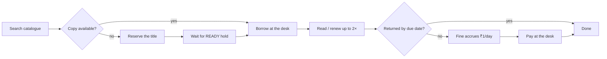
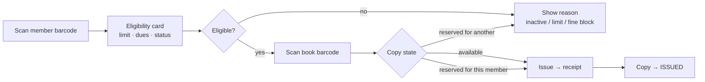
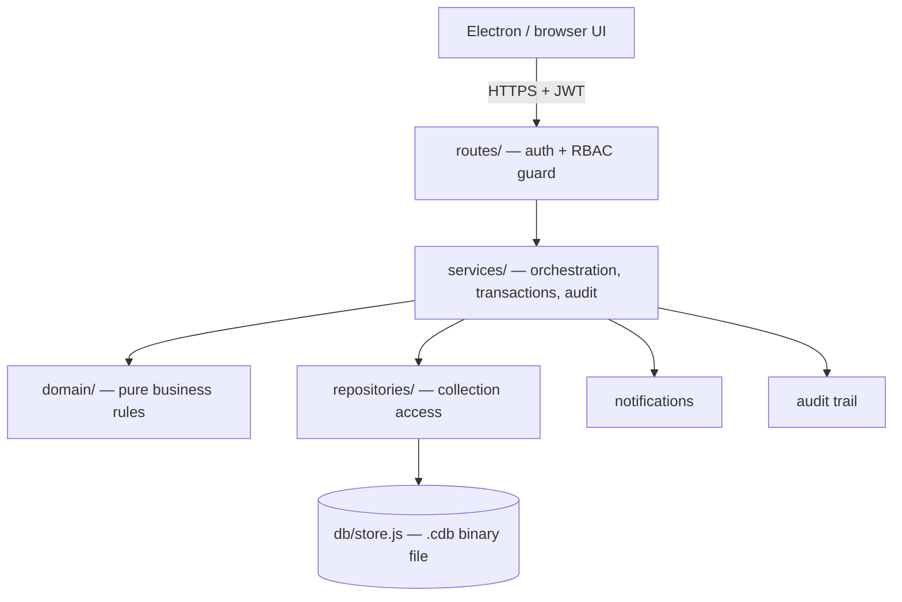
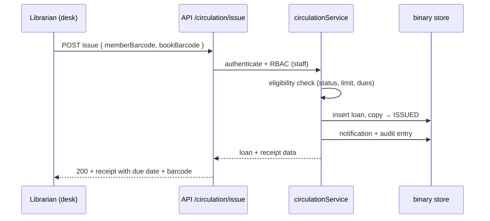
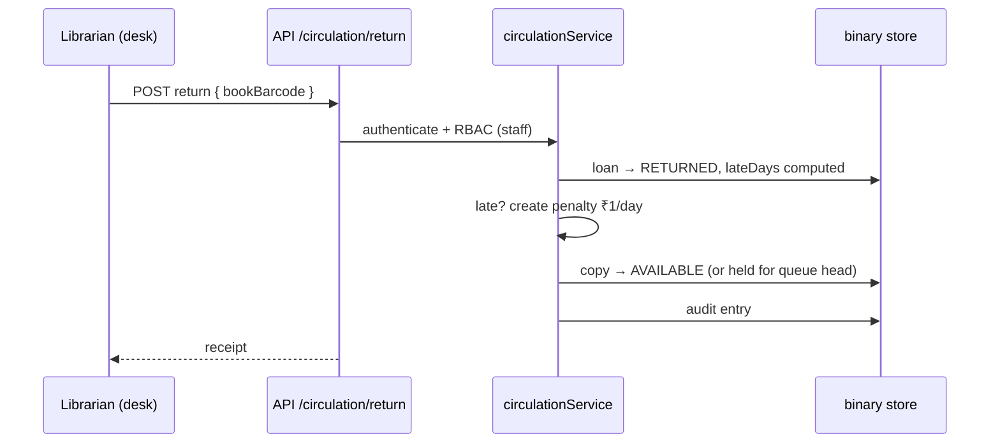

# KCT Library — Application Workflows

This document describes how each role uses the system and how a request
travels through the application, from the UI to the binary store.

## Roles

| Role | Scope | Sign-in identity |
|---|---|---|
| **Student** | Borrows books, tracks own history and dues | Roll number (e.g. `CSE2201`) + password |
| **Teacher (Faculty)** | Same as a student, with a longer loan period and higher limits | Staff id (e.g. `FAC1001`) + password |
| **Librarian** | Runs the desk, registers members, manages the catalogue | Username + password |
| **Admin** | Everything a librarian can do, plus staff accounts, policies, reports and the audit log | Username + password |

Every password is stored only as a bcrypt hash. The seeder and the
member-registration screen generate a temporary password and show it **once**;
there are no default passwords in the codebase.

---

## 1. Student / Teacher workflow (the member side)

A signed-in student or teacher sees the **My Library** workspace: active
loans, due dates, fines, reservations and borrowing history.

Step by step:

1. **Find a book.** Open *Book Catalog*, search by title, author, subject or
   keyword. The detail view shows how many copies are on the shelf and what
   each copy is doing (available / issued / reserved). A *similar books* panel
   recommends related titles.
2. **Borrow.** If a copy is available, take the book to the issue & return
   desk. The librarian scans the member barcode and the book barcode; the
   system checks eligibility (active member, under the borrow limit, fines
   below the block threshold) and issues the book, printing a receipt with the
   due date and a Code 128 barcode.
3. **Reserve** if every copy is out. The reservation enters a queue (max 5 per
   title; faculty first, then first-come). When a copy is returned it is held
   for the head of the queue for **48 hours**; the member gets a *READY*
   notification and collects it at the desk.
4. **Renew.** A loan can be renewed twice, as long as the book is not
   overdue and nobody is waiting in the reservation queue.
5. **Return.** Return the book at the desk; the copy goes back on the shelf
   (or is held for the next member in the queue). If it came back late, a
   penalty of **₹1 per late day** is created automatically.
6. **Pay fines.** Unpaid dues are listed under *My Library*. If they reach
   **₹50**, borrowing is blocked until they are settled at the desk.

**Differences for teachers:** 30-day loans instead of 14, 5 books instead of
3, and priority in the reservation queue.

---

## 2. Librarian workflow (the desk side)

The librarian's home is the **Issue & Return Desk**: scan a member barcode to
see eligibility, then scan a book barcode to issue or return.

Day to day a librarian also:

- **Registers members** — name, roll number, role (STUDENT/FACULTY), department
  and year. The system generates a temporary password and displays it once to
  hand over; a *reset password* action works the same way.
- **Manages the catalogue** — add a title (ISBN, author, publisher, category,
  subject, keywords) and then add physical copies, each getting an automatic
  barcode `LIB-<BOOKCODE>-NNN` and a shelf location. Copies can be marked
  LOST, DAMAGED or in MAINTENANCE.
- **Collects fines** — see a member's unpaid penalties and mark them paid,
  printing a receipt.
- **Runs the daily sweep** — an idempotent job that expires stale READY holds,
  raises or tops up overdue penalties and sends *due soon* / *overdue*
  notifications. Safe to run repeatedly.

---

## 3. Admin workflow (the management side)

An admin sees everything a librarian sees, plus the administration section:

- **Staff accounts** — create librarian and admin accounts (the only way
  staff identities enter the system), with role assignment.
- **Lending policies** — loan days, borrow limits, hold windows, fine per day,
  block threshold, due-soon window and reservation-queue depth, per role.
- **Reports** — live summary (books, copies, issued, reserved, overdue,
  members, active loans, unpaid dues, issues/returns this week) and
  circulation history.
- **Audit log** — every security-relevant action (login, issue, return,
  member create/update/status change, password reset, policy change, staff
  create) is recorded with who did it, when, and before/after values.

---

## 4. End-to-end application workflow

How a single request travels through the layers:

1. **UI** — the Electron window (or browser) calls `/api/…` with the JWT from
   login in an `Authorization: Bearer` header.
2. **Routes** — express routers validate the input and enforce the role guard
   (member-only, staff-only or admin-only) before anything touches the data.
3. **Services** — orchestrate the operation: check eligibility, mutate loans,
   write penalties, send notifications, record audit entries.
4. **Domain** — pure functions hold the rules (can-issue, can-renew,
   due-date, fine, queue ordering). No I/O, so they are unit-tested directly.
5. **Repositories** — read/write the collections.
6. **Store** — every write goes to a binary `.cdb` file (MessagePack +
   deflate + CRC32) via an atomic temp-file-and-rename, so a crash can never
   leave a half-written database. Data lives in `backend/data/`, which is
   gitignored and never committed.

### Borrow a book — sequence

### Return a book — sequence

## 5. Data lifecycle at a glance

| Entity | States |
|---|---|
| Copy | AVAILABLE → ISSUED → (returned) AVAILABLE · AVAILABLE → RESERVED (held 48 h) → ISSUED · LOST / DAMAGED / MAINTENANCE |
| Loan | ACTIVE → RETURNED (with `lateDays` and optional penalty) |
| Reservation | WAITING → READY (copy held) → COMPLETED / CANCELLED / EXPIRED |
| Member | ACTIVE → SUSPENDED → ACTIVE (suspension blocks borrowing) |
| Penalty | UNPAID → PAID (₹50+ unpaid blocks borrowing) |
